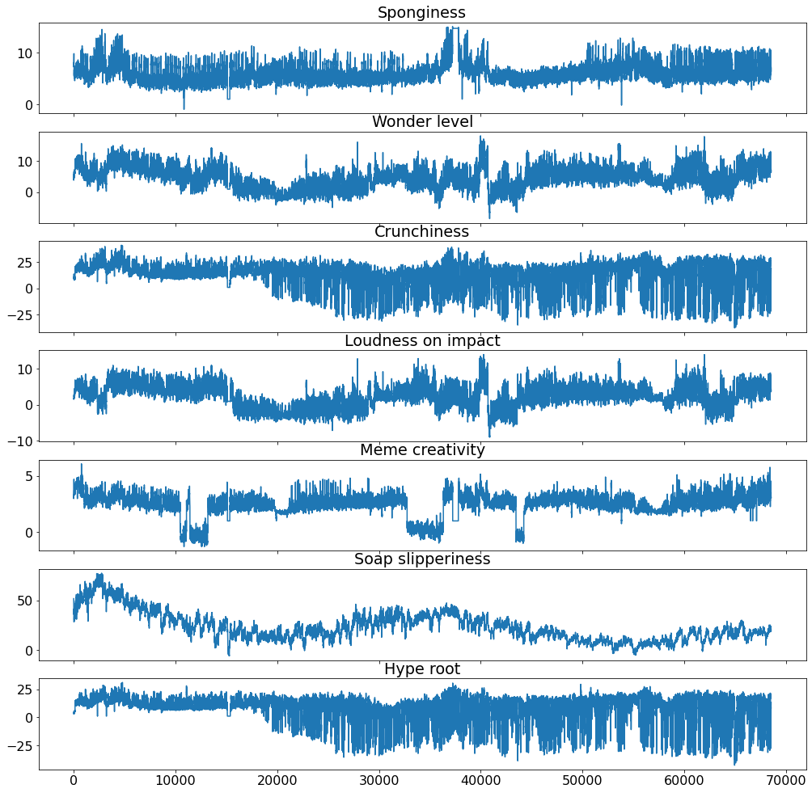
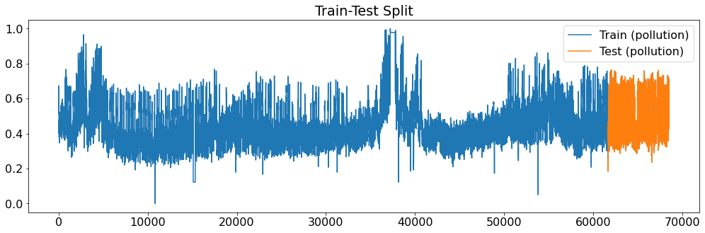
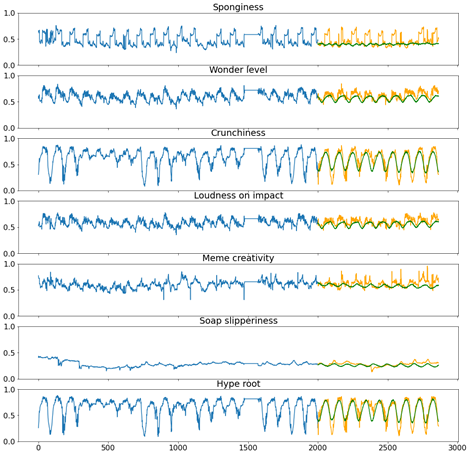
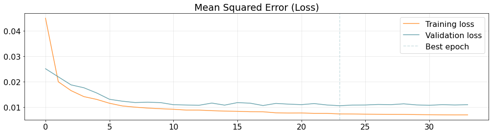
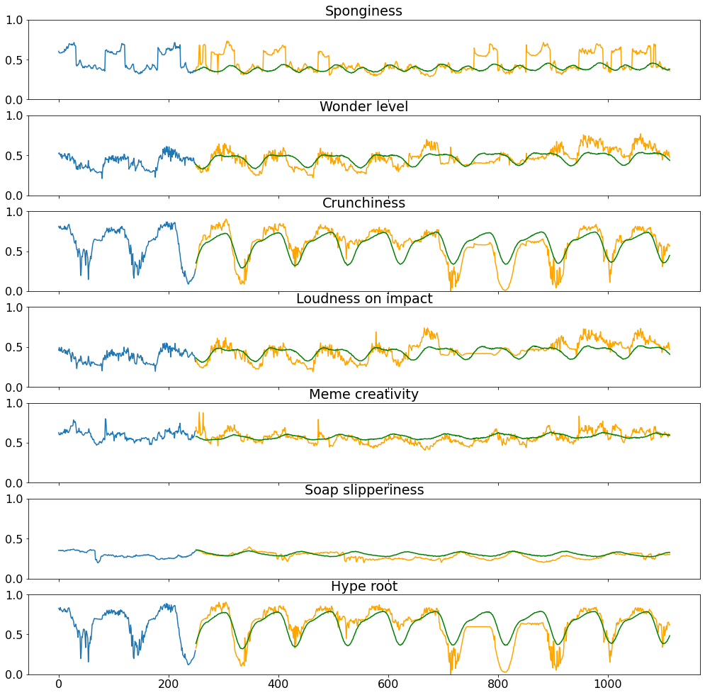
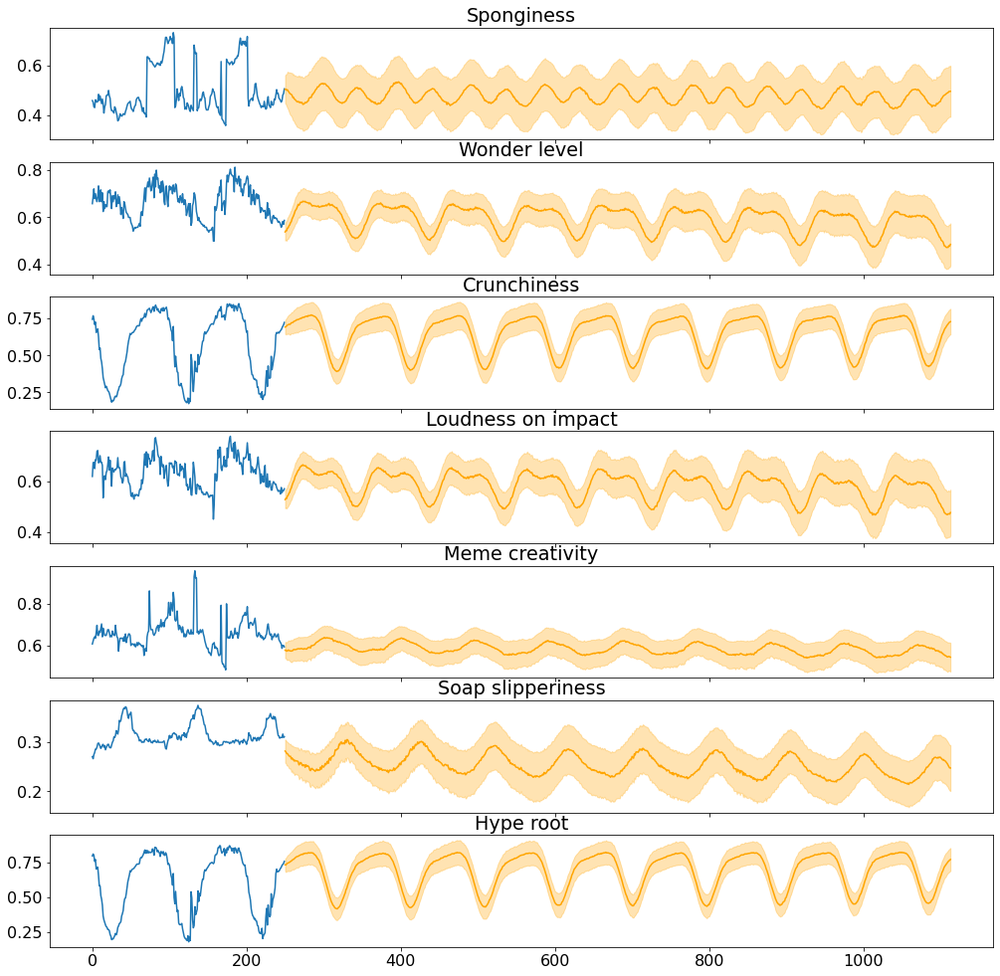

# TimeSeriesForecasting

The goal is to design a Neural Network able to forecast a multivariate time series composed of 7 different components.
Time Series Forecasting of what? Dataset have features with casual name to avoid use of external data.

In the notebook are present two implementations: "Direct Forecasting" and "AutoRegressive Forecasting"

## Dataset 

  

## Split

From assignment we need to predict next 864 values of time series. So we split and create a test set of that quantity.

  

## Model

We put in parallel 3 Gru model and we average their prediction.

  

The metric used to evaluate models and place the Teams in Leaderboard is the Root Mean Squared Error (RMSE). 

Performance of AutoRegressive implementation:

RMSE = 3.9455

## Training

We use Adam optimizer, reduce learning rate on plateau and early stopping to stop the training and restore best weights to avoid overfitting.

  

## Prediction

  

  

