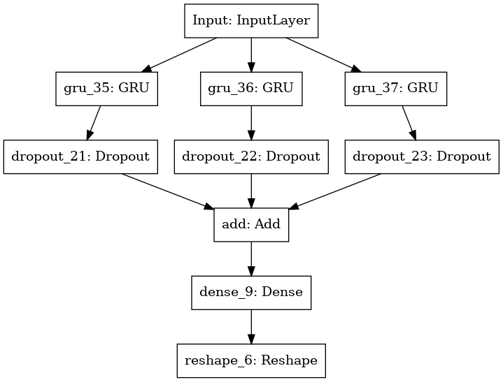
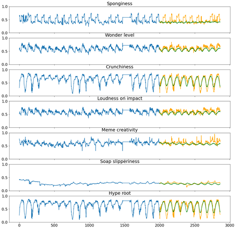

# TimeSeriesForecasting

The goal is to design and implement forecasting models to learn how to exploit past observations in the input sequence to correctly predict the future. 

In the notebook are present two implementations: "Direct Forecasting" and "AutoRegressive Forecasting"

  

The metric used to evaluate models and place the Teams in Leaderboard is the Root Mean Squared Error (RMSE). 

Time Series Forecasting of what? Dataset have censored features, so field of application is unknown

Performance of AutoRegressive implementation:

RMSE = 3.9455

  

